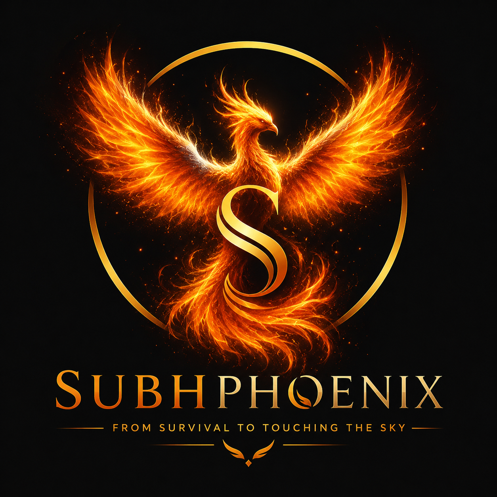

# 🕊️ SubhPhoenix
### *From Survival to Touching the Sky*

**An AI-powered, multilingual humanitarian platform for refugees and displaced people.**

---

## 🌍 About the Project

**SubhPhoenix** is not just a website — it is a **digital companion** built to stand beside people in some of the hardest moments of their lives. It helps refugees and displaced individuals find shelter, food, medical care, legal guidance, and emotional support — all in their **own language**.

Millions of displaced people face a second crisis after fleeing danger: the inability to communicate, understand local systems, or access help because of language and technology barriers. SubhPhoenix exists to remove that barrier.

> *"Technology should not be a privilege for the comfortable — it should be a lifeline for the vulnerable."*

---

## 🎯 Vision

To build a platform where **every refugee**, regardless of language, literacy, or technical comfort, can access essential services, connect with volunteers and NGOs, and receive emotional support — with dignity.

---

## 👥 Who It's For

| User Type | What They Can Do |
|---|---|
| 🧍 **Refugees** | Find shelter, food, medical aid, legal guidance, mental health support, family reunification, emergency SOS |
| 🏢 **NGOs** | Manage cases, respond to requests, update available resources, communicate across languages |
| 🤝 **Volunteers** | Assist refugees, translate conversations, connect people to nearby organisations |
| 🛡️ **Administrators** | Verify NGOs, manage users, moderate content, monitor platform usage |

---

## ✨ Core Features

### 🌐 Full Multilingual Experience
Not just translated content — the **entire platform** (navigation, forms, dashboards, chatbot, emails, and help centre) adapts to the user's language.

**Supported Languages (v1):**
English · Hindi · Urdu · Arabic · Dari · Pashto · Persian (Farsi) · Turkish · French · Spanish · German · Italian · Portuguese · Ukrainian · Russian · Simplified Chinese · Japanese · Korean · Greek · Swahili

Built to easily support more languages over time.

### 🧠 Smart Language System
- Auto-detects browser language
- Manual language switcher on every page
- "Remember my language" preference
- Instant switching — no page reload

### 🤖 HopeLens AI — Multilingual AI Assistant
An intelligent companion that understands multiple languages, translates conversations, answers questions, offers emotional support, and connects users to nearby help — explained in simple, human terms.

### 🔁 Real-Time Translation
A refugee writes in Urdu → a volunteer reads and replies in English → the refugee receives the reply in Urdu. **Neither person needs to know the other's language.**

### 💙 Mental Health Support
Mood check-ins, stress and anxiety screening, guided breathing exercises, positive affirmations, AI emotional support, and crisis contacts — all available in the user's language.

### 🗺️ Shelter & Resource Finder
Interactive maps to locate shelters, food centres, hospitals, NGOs, legal aid, schools, and community centres nearby.

### 🚨 Emergency SOS
One-click access to emergency contacts, nearest hospital, police, fire services, women's helplines, and child protection services — in the user's language.

### 🧩 Low Literacy Mode
Large illustrated icons with voice guidance for users who struggle with reading, covering essentials like shelter, food, water, and emergency help.

### ♿ Accessibility First
Large text mode · Dark mode · Mobile-first design · Voice guidance · Text-to-speech & speech-to-text · Offline access to essential information

### 📊 Role-Based Dashboards
Dedicated dashboards for **Refugees**, **NGOs**, and **Volunteers** to track requests, manage cases, and communicate seamlessly across languages.

---

## 🎨 Design Philosophy

SubhPhoenix is designed to feel **calm, safe, and welcoming** — never clinical or intimidating.

- Premium, modern UI with glassmorphism and soft gradients
- Smooth, non-jarring animations
- Fully responsive across devices
- Colour palette: Deep Blue, Teal, White, Soft Green, with Warm Orange for alerts

**Smart Regional Mode** adapts the experience further — for example, right-to-left layouts for Arabic users, and regionally relevant resources based on language selection.

---

## 🛠️ Tech Stack

| Layer | Technology |
|---|---|
| **Frontend** | HTML, CSS, JavaScript |
| **Backend** | Node.js, Express.js |
| **Database** | MongoDB |
| **Authentication** | JWT |
| **Maps** | Leaflet.js / OpenStreetMap |
| **AI** | OpenAI API (or another multilingual model) |
| **Translation** | Translation API + local language files |
| **Speech** | Speech-to-Text / Text-to-Speech |
| **Deployment** | Vercel (Frontend) · Render (Backend) |

---

## 🗺️ Development Roadmap

- [ ] **Phase 1** — UI/UX Design, Landing Page, Navigation, Language System
- [ ] **Phase 2** — Authentication, Dashboards, Database
- [ ] **Phase 3** — AI Chatbot, Translation, Voice Support
- [ ] **Phase 4** — Maps, NGO Tools, Emergency System
- [ ] **Phase 5** — Testing, Deployment, Optimisation

---

## 🚀 Long-Term Vision

SubhPhoenix is designed to grow beyond its origins into a platform that can support refugees, asylum seekers, migrants, disaster survivors, and the humanitarian organisations and volunteers who serve them.

The goal is simple: **remove language barriers, improve access to critical services, and help people rebuild their lives with dignity through technology.**

---

### 💙 SubhPhoenix — *From Survival to Touching the Sky*

*Built with the belief that no one should be lost in desparation and translation when they need help the most.*

